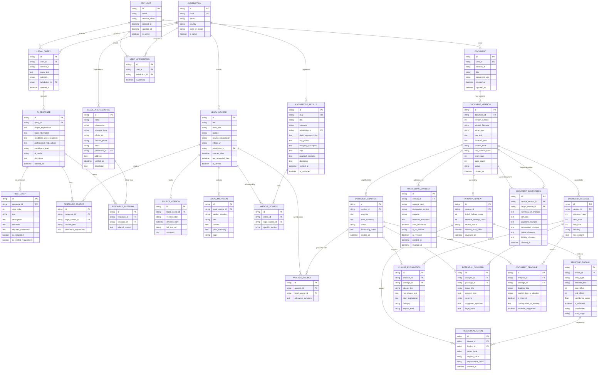

# Legal Rights Awareness Assistant - Database ER Diagram

The following Mermaid ER Diagram models the complete 27-entity relational schema implemented in PostgreSQL and SQLAlchemy 2.0.

```mermaid
erDiagram
    APP_USER ||--o{ LEGAL_QUERY : "submits"
    APP_USER ||--o{ DOCUMENT : "owns"
    APP_USER ||--o{ USER_JURISDICTION : "selects"

    JURISDICTION ||--o{ USER_JURISDICTION : "assigned to"
    JURISDICTION ||--o{ LEGAL_SOURCE : "scopes"
    JURISDICTION ||--o{ KNOWLEDGE_ARTICLE : "applies to"
    JURISDICTION ||--o{ LEGAL_AID_RESOURCE : "operates in"
    JURISDICTION ||--o{ LEGAL_QUERY : "contexts"

    LEGAL_QUERY ||--o{ AI_RESPONSE : "receives"

    AI_RESPONSE ||--o{ NEXT_STEP : "recommends"
    AI_RESPONSE ||--o{ RESPONSE_SOURCE : "cites"
    AI_RESPONSE ||--o{ RESOURCE_REFERRAL : "refers"

    LEGAL_SOURCE ||--o{ SOURCE_VERSION : "tracks"
    LEGAL_SOURCE ||--o{ LEGAL_PROVISION : "contains"
    LEGAL_SOURCE ||--o{ ARTICLE_SOURCE : "referenced by"
    LEGAL_SOURCE ||--o{ RESPONSE_SOURCE : "cited in"
    LEGAL_SOURCE ||--o{ ANALYSIS_SOURCE : "corroborates"

    KNOWLEDGE_ARTICLE ||--o{ ARTICLE_SOURCE : "cites"

    LEGAL_AID_RESOURCE ||--o{ RESOURCE_REFERRAL : "linked from"

    DOCUMENT ||--o{ DOCUMENT_VERSION : "has versions"

    DOCUMENT_VERSION ||--o{ DOCUMENT_PASSAGE : "parsed into"
    DOCUMENT_VERSION ||--o{ PRIVACY_REVIEW : "scanned by"
    DOCUMENT_VERSION ||--o{ PROCESSING_CONSENT : "authorized by"
    DOCUMENT_VERSION ||--o{ DOCUMENT_ANALYSIS : "simplified into"
    DOCUMENT_VERSION ||--o{ DOCUMENT_COMPARISON : "source document"
    DOCUMENT_VERSION ||--o{ DOCUMENT_COMPARISON : "target document"

    PRIVACY_REVIEW ||--o{ SENSITIVE_FINDING : "detects"
    PRIVACY_REVIEW ||--o{ REDACTION_ACTION : "applies"
    SENSITIVE_FINDING ||--o{ REDACTION_ACTION : "targeted by"

    DOCUMENT_ANALYSIS ||--o{ CLAUSE_EXPLANATION : "explains"
    DOCUMENT_ANALYSIS ||--o{ POTENTIAL_CONCERN : "flags"
    DOCUMENT_ANALYSIS ||--o{ DOCUMENT_DEADLINE : "extracts"
    DOCUMENT_ANALYSIS ||--o{ ANALYSIS_SOURCE : "grounded with"

    DOCUMENT_PASSAGE ||--o{ CLAUSE_EXPLANATION : "anchors"
    DOCUMENT_PASSAGE ||--o{ POTENTIAL_CONCERN : "anchors"
    DOCUMENT_PASSAGE ||--o{ DOCUMENT_DEADLINE : "anchors"

    APP_USER {
        string id PK
        string email
        string session_token
        datetime created_at
        datetime updated_at
        boolean is_active
    }

    LEGAL_QUERY {
        string id PK
        string user_id FK
        string session_id
        text query_text
        string category
        string jurisdiction_id FK
        datetime created_at
    }

    AI_RESPONSE {
        string id PK
        string query_id FK
        text simple_explanation
        text legal_information
        text conditions_and_exceptions
        text professional_help_advice
        string confidence_level
        string ai_model
        text disclaimer
        datetime created_at
    }

    NEXT_STEP {
        string id PK
        string response_id FK
        int step_order
        string title
        text description
        text rationale
        text required_information
        boolean is_completed
        boolean is_verified_requirement
    }

    RESPONSE_SOURCE {
        string id PK
        string response_id FK
        string legal_source_id FK
        string citation_text
        text relevance_explanation
    }

    LEGAL_AID_RESOURCE {
        string id PK
        string name
        string organization
        string resource_type
        string official_url
        string contact_phone
        string email
        string jurisdiction_id FK
        text address
        datetime verified_at
        text description
    }

    RESOURCE_REFERRAL {
        string id PK
        string response_id FK
        string resource_id FK
        text referral_reason
    }

    DOCUMENT {
        string id PK
        string user_id FK
        string session_id
        string title
        string document_type
        datetime created_at
        datetime updated_at
    }

    DOCUMENT_VERSION {
        string id PK
        string document_id FK
        int version_number
        string original_filename
        string mime_type
        text raw_text
        text sanitized_text
        string content_hash
        string raw_content_hash
        int char_count
        int page_count
        string status
        datetime created_at
    }

    DOCUMENT_PASSAGE {
        string id PK
        string version_id FK
        int passage_index
        int start_char
        int end_char
        string heading
        text text_content
    }

    PRIVACY_REVIEW {
        string id PK
        string version_id FK
        int initial_findings_count
        int residual_findings_count
        string review_status
        boolean second_scan_clean
        datetime reviewed_at
    }

    SENSITIVE_FINDING {
        string id PK
        string review_id FK
        string entity_type
        string detected_text
        int start_offset
        int end_offset
        float confidence_score
        boolean is_redacted
        string placeholder
        string scan_stage
    }

    REDACTION_ACTION {
        string id PK
        string review_id FK
        string finding_id FK
        string action_type
        string original_value
        string replacement_value
        datetime created_at
    }

    PROCESSING_CONSENT {
        string id PK
        string version_id FK
        string content_hash
        string destination_service
        string purpose
        text retention_limitations
        boolean user_affirmation
        string ip_or_session
        boolean is_revoked
        datetime granted_at
        datetime revoked_at
    }

    DOCUMENT_ANALYSIS {
        string id PK
        string version_id FK
        text overview
        text plain_summary
        string status
        text processing_notes
        datetime created_at
    }

    DOCUMENT_COMPARISON {
        string id PK
        string source_version_id FK
        string target_version_id FK
        text summary_of_changes
        text diff_json
        text payment_changes
        text termination_changes
        text notice_changes
        text liability_changes
        datetime created_at
    }

    JURISDICTION {
        string id PK
        string code UK
        string name
        string country
        string state_or_region
        boolean is_active
    }

    USER_JURISDICTION {
        string id PK
        string user_id FK
        string jurisdiction_id FK
        boolean is_primary
    }

    KNOWLEDGE_ARTICLE {
        string id PK
        string slug UK
        string title
        string category
        string jurisdiction_id FK
        text plain_language_intro
        text key_points
        text everyday_examples
        text faqs
        text practical_checklist
        text disclaimer
        datetime verified_at
        boolean is_published
    }

    LEGAL_SOURCE {
        string id PK
        string title
        string short_title
        string citation
        string issuing_organization
        string official_url
        string jurisdiction_id FK
        datetime enacted_date
        datetime last_amended_date
        boolean is_verified
    }

    SOURCE_VERSION {
        string id PK
        string legal_source_id FK
        string version_label
        datetime effective_from
        string full_text_url
        text summary
    }

    ARTICLE_SOURCE {
        string id PK
        string article_id FK
        string legal_source_id FK
        string specific_section
    }

    LEGAL_PROVISION {
        string id PK
        string legal_source_id FK
        string section_number
        string title
        text content
        text plain_summary
        string tags
    }

    CLAUSE_EXPLANATION {
        string id PK
        string analysis_id FK
        string passage_id FK
        string clause_title
        text raw_clause_text
        text plain_explanation
        string category
        string impact_level
    }

    POTENTIAL_CONCERN {
        string id PK
        string analysis_id FK
        string passage_id FK
        string issue_title
        text concern_text
        string severity
        text suggested_question
        text legal_basis
    }

    DOCUMENT_DEADLINE {
        string id PK
        string analysis_id FK
        string passage_id FK
        string deadline_title
        string explicit_date_or_duration
        boolean is_inferred
        text consequence_of_missing
        boolean reminder_suggested
    }

    ANALYSIS_SOURCE {
        string id PK
        string analysis_id FK
        string legal_source_id FK
        text relevance_summary
    }
```
